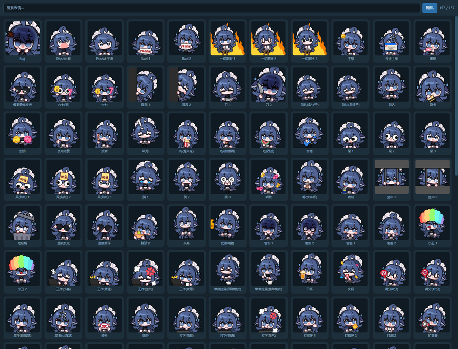
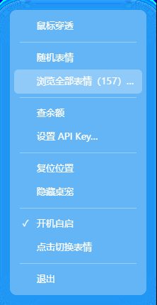

<div align="center">


# 鲸鱼娘桌宠

**一个现代化简单美观的 Windows 桌面宠物。**

[**下载**](https://github.com/Ker0el/whale-girl-pet/releases/latest) ·
Windows 10/11 x64 ·
免安装、免 Node、**素材已内置**

</div>

---

## 它是什么

一只浮在桌面上的鲸鱼娘。右键它打开菜单，点「浏览全部表情」挑一个，它就换成那个表情并一直保持 —— 不会过一会儿自己变回别的。挑过的会被记住，下次开机还是那张。

第一次启动它会挥手打个招呼，用气泡说句「你好呀」，十秒后（或者你点一下气泡）换成平时工作的样子。

它也会说话：一言、余额、打招呼都走同一个自绘的小气泡，浮在它上方，尾巴指着它，点一下消失。

透明无边框，不占任务栏，点它不会抢走你编辑器的焦点。

<div align="center">

<br />
<sub>157 个表情，多列网格 + 搜索，直接看到动画</sub>
</div>

## 特性

- **选哪张就停在哪张** —— 没有"待机姿势"，不会在你不操作时变来变去
- **记住你的选择** —— 重启后还是上次那张
- **透明置顶** —— 浮在其他窗口之上，但不激活、不抢焦点
- **拖动 / 滚轮缩放 / 双击复位**
- **会说话** —— 自绘的小气泡，四种样式可选；第一次启动会挥手打招呼
- **一言** —— 默认每 5 分钟念一句带出处的句子，间隔可改，菜单里可关
- **右键菜单**，另有托盘图标（单击显示或隐藏）
- **三个开关**：鼠标穿透、开机自启、一言
- **可选**：查 DeepSeek 余额、今日消费、当前计费时段（自己填 API Key，用 Windows 凭据加密后存在本机）；填了之后每到整点自动报一次

<div align="center">

</div>

## 下载与安装

到 [**Releases**](https://github.com/Ker0el/whale-girl-pet/releases/latest) 下载 `whale-girl-pet-setup-<版本>.exe`，双击按向导走完即可。**素材已经打进安装包**，装完直接能用，不需要再下别的东西。

安装位置默认是**安装程序所在文件夹下的同名子文件夹**：

```
setup 放在 D:\下载\        →  装到 D:\下载\鲸鱼娘桌宠\
setup 放在 E:\给朋友的\     →  装到 E:\给朋友的\鲸鱼娘桌宠\
```

向导里可以改。卸载走「应用和功能」，或者安装目录里的 `unins000.exe`。

> **装完别移动安装目录。** 开机自启指向的是绝对路径，移动后需要重新开关一次菜单里的「开机自启」。

也可以从源码打包成免安装 zip，见[从源码构建](#从源码构建)。

## 使用

| 操作 | 效果 |
| --- | --- |
| 左键拖动 | 移动位置 |
| 滚轮 | 放大 / 缩小 |
| 双击 | 恢复默认大小 |
| 右键 | 打开菜单 |
| 托盘图标单击 | 显示 / 隐藏 |

## 加自己的表情

把 `.gif` 丢进安装目录下的 `蓝色大肥鱼表情包` 文件夹，重启桌宠即可。文件名会成为菜单里的显示名，所以起个看得懂的名字。

想换开机默认显示的那张，改 `main.js` 里的 `DEFAULT_REACTION`。

## 常见问题

**找不到菜单 / 关不掉它**
右键桌宠，或者看屏幕右下角托盘区的图标。Windows 11 默认把新托盘图标收在 `^` 箭头里，拖出来就行。

**查余额的数字准吗**
「余额」是官方接口返回的实时值。「今日消费」是**本机累计**的：DeepSeek 只提供当前余额，没有用量接口（`/user/usage` 一类的路径全是 404），所以程序每 10 分钟采一次余额、把观察到的下降累加进当天。消费后又充值的那一段会漏掉。要准确账单请上 [platform.deepseek.com](https://platform.deepseek.com) 后台。

填了 API Key 之后，每到整点会自动查一次，结果用气泡报给你，不再弹 Windows 通知。

**一言会联网吗**
会 —— 这是程序里唯一连第三方服务器的地方（公开的 [一言](https://hitokoto.cn/) 接口 `v1.hitokoto.cn`，不通时自动换成备用接口 `uapis.cn`）。默认每 5 分钟一次，间隔在菜单里改，不想要就在菜单里关掉「一言」。除此之外只剩查余额会联网，那需要你自己填 Key。

句子类型也能挑，一共十二种（动画 / 漫画 / 游戏 / 文学 / 原创 / 来自网络 / 其他 / 影视 / 诗词 / 网易云 / 哲学 / 抖机灵），默认勾文学、来自网络、影视、诗词、网易云、哲学，一个都不勾就是不限类型。备用接口不支持按类型筛选，所以主站不通时拿到的可能是任意类型。

**会不会在我打游戏时跳出来挡着**
不会盖住独占全屏的游戏。普通窗口和大多数全屏应用之上会显示；真碍事就右键 →「鼠标穿透」，或者点一下托盘图标把它收起来。

**怎么彻底删掉**
「应用和功能」里卸载，或者跑安装目录里的 `unins000.exe`。配置留在 `%APPDATA%\WhaleGirlPet\`，想一并清掉手动删这个文件夹。

## 从源码构建

```bash
git clone https://github.com/Ker0el/whale-girl-pet.git
cd whale-girl-pet
npm install
npm start          # 开发模式
npm run pack       # 免安装 zip: dist/鲸鱼娘桌宠-1.1.0-win.zip
```

需要 Node.js 22+。

### 构建安装程序

需要另外装 [Inno Setup 6](https://jrsoftware.org/isdl.php)，然后：

```bat
build\make-installer.cmd
```

脚本会先产出 `dist\win-unpacked\`，再用 Inno Setup 编成单文件安装程序。产物体积约 585 MB —— 473 MB 是素材，其余是压缩后的 Electron 运行时。

素材在 `build\installer.iss` 里标了 `nocompression`：GIF 已经压过了，再走一遍 LZMA 只能省 0.5%，却会把打包时间从一分钟拖到十几分钟。

## 素材

**这个仓库不包含任何 GIF 素材。** 素材包共约 475 MB，不适合放进 git：

- `assets/蓝色大肥鱼表情包/` —— 表情动画
- `assets/素材/` —— 皮肤帧（可选，只在从未选过表情时用作初始画面）

程序启动时读取程序同级目录下的这两个文件夹，因此你可以自由替换成任何喜欢的 GIF。

本项目的表情素材来自 B 站 UP 主 **「赤风RED」**，经授权用于本桌宠。素材版权归原作者所有 —— 如果你要用在别处，请自行联系原作者获取授权。

程序代码基于 [Electron](https://www.electronjs.org/)（MIT）。

## 实现上有意思的几处

- **点击穿透**是开关而不是自动的。早年试过跟着角色轮廓做 alpha 判定，结果是"要瞄准"—— GIF 大部分区域是透明的，角色还会在帧内移动。整块方形热区更好点，需要穿透时用菜单里的开关。
- **开机自启**在 Windows 上按「可执行文件 + 参数」匹配注册表项，所以读取时必须传和写入时一样的路径参数，否则开发模式下永远匹配不上，关闭开关会变成又写一次。
- **素材经由主进程读取**并以 `blob:` URL 交给渲染进程。`file://` 页面绘制 `file://` 图片会污染 canvas；直接用 `file://` 路径加载又需要在 CSP 里放行，而 Chromium 的 `file://` 源是不透明的，靠不住。
- **自绘菜单**而非原生菜单：原生菜单跟随系统样式，跟一只可爱桌宠放在一起很违和。代价是贴边翻转、点外关闭、ESC 关闭都要自己实现。
- **安装包文件名是 ASCII**（`whale-girl-pet-setup-*`）：GitHub 的 release 附件名不接受非 ASCII，中文会被清洗成 `-.-1.0.0.exe` 这种。对外显示的中文名走 AppName、窗口标题和快捷方式，不受影响。
- **计费时段**（高峰 / 空闲半价）按北京时间判定，与这台机器的时区无关。高峰 = 周一至周五 9:00-12:00 与 14:00-18:00，**排除中国法定节假日**，所以 `peak.js` 里内置了一份节假日表（来源：国办发明电〔2025〕7 号）。`node tools/test-peak.js` 覆盖了 26 个用例，含节假日、周末和窗口边界。

## 赞赏

如果这只桌宠让你开心了一下，可以请我喝杯奶茶。

<div align="center">

<br />
<sub>扫码即可，金额随意。谢谢！</sub>
</div>

作者：**星空** · [B站主页](https://space.bilibili.com/177308205)

## License

代码采用 [MIT](LICENSE)。素材版权归原作者「赤风RED」所有，不适用 MIT。
